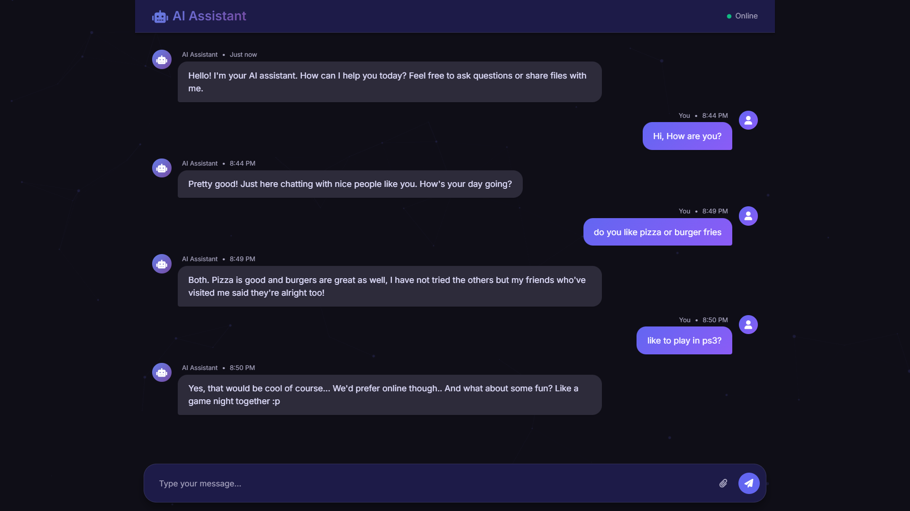

# 🤖 Flask AI ChatBot Application

A conversational web chatbot built using **Flask** and **HuggingFace Transformers**, capable of handling:

- Natural language conversation with `DialoGPT`
- PDF summarization
- Image classification
- Text file analysis
- File upload and processing
- REST API support

---

## 🚀 Features

- **Conversational AI**: Uses `DialoGPT-medium` for maintaining multi-turn chat.
- **PDF Summarization**: Extracts and summarizes content from `.pdf` files.
- **Image Classification**: Identifies image content using Vision Transformers (`ViT`).
- **Text Analysis**: Reads and processes `.txt`, `.md` files.
- **File Uploads**: Accepts files via HTTP POST for analysis.
- **Conversation Memory**: Remembers conversation history until reset.
- **Error Handling**: Graceful error reporting with reset options.

---

## 🛠️ Requirements

```bash
pip install flask transformers torch pdfminer.six Pillow werkzeug
```

Optional (for fallback PDF handling):
```bash
pip install PyPDF2
```

---

## 📁 Project Structure

```
│   app.py
│   README.md
│   requirements.txt
│
├───static
│   ├───css
│   │       style.css
│   │
│   └───js
│           partcile.js
│
├───templates
│       index.html
│
└───uploads
```

---

## 🧠 Models Used

| Task                    | Model Name                                 |
|-------------------------|---------------------------------------------|
| Chatbot Conversation    | `microsoft/DialoGPT-medium`                |
| Image Classification    | `google/vit-base-patch16-224`              |
| Text Summarization      | `sshleifer/distilbart-cnn-12-6`            |

---

## 🔧 How to Run

1. Clone this repo or copy the code.
2. Ensure required packages are installed.
3. Run the app:

```bash
python app.py
```

4. Open browser and go to:

```
http://localhost:5000
```

---

## 🌐 API Endpoints

| Method | Route       | Description                                 |
|--------|-------------|---------------------------------------------|
| GET    | `/`         | Loads the HTML frontend                     |
| POST   | `/chat`     | Handles text or file chat requests          |
| POST   | `/reset`    | Resets the conversation history             |
| GET    | `/status`   | Returns current model and memory status     |
| GET    | `/test`     | Returns a sample chatbot response           |

---

## 📂 File Support

| File Type | Functionality                  |
|-----------|--------------------------------|
| `.png`, `.jpg`, `.gif`, etc. | Image classification |
| `.pdf`    | PDF text extraction & summary  |
| `.txt`, `.md` | Text analysis & summary       |

---

## 📝 Example Request (cURL)

```bash
curl -X POST http://localhost:5000/chat      -F "message=Hello, how are you?"
```

```bash
curl -X POST http://localhost:5000/chat      -F "file=@example.pdf"
```

---

## 🧼 Reset Conversation

```bash
curl -X POST http://localhost:5000/reset
```

---

## 🔍 Status Check

```bash
curl http://localhost:5000/status
```

---

## 👋 Credits

- Developed using **Flask**, **Transformers**, and **Torch**
- HuggingFace for powerful pre-trained models
- Open-source vision model: ViT (Google)
- NLP summarization model: DistilBART

---

## 📜 License

MIT License — use freely with attribution.

---

## 💡 Future Improvements

- User authentication
- Session-based conversation memory
- Streamed response handling
- Frontend improvements with AJAX

---

Happy Chatting! ✨

---

## 🖥️ Frontend (index.html)

The application comes with a modern, responsive chat interface built using:

- **Bootstrap 5**: For responsive layout
- **Font Awesome**: For icons (robot, paperclip, send, etc.)
- **Google Fonts (Inter)**: Clean and readable typography
- **Particles.js**: Animated background for a dynamic visual
- **Vanilla JS + Axios**: To send/receive messages and file uploads

### 🔑 Features:
- User-friendly chat interface with timestamped messages
- Typing indicators and file upload feedback
- Drag-and-drop support for files
- Mobile responsive and keyboard accessible
- Smart error handling for timeouts and large files
- File types supported: `.png`, `.jpg`, `.gif`, `.pdf`, `.txt`, `.md`

To modify the design, update the `templates/index.html` and `static/css/style.css`.
## 🖼️ Chat Interface Preview




